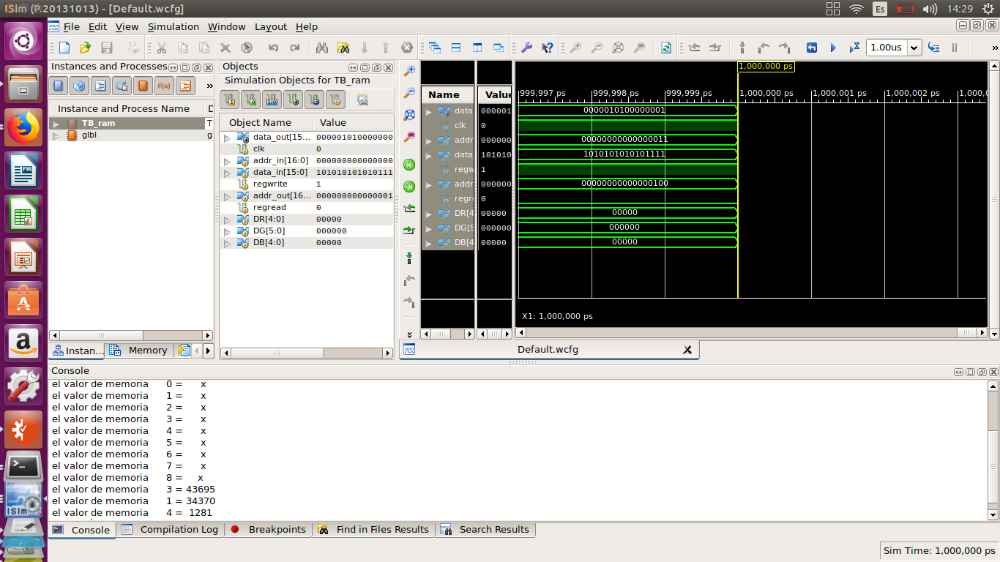

## Aquí se debe  documentar todo el proceso del proyecto acorde a cada paquete de trabajo

Integrantes Del grupo
=======================
Adolfo Byron Erazo  
Jhon Edison Bohorquez Martinez  

*regunta 1:*

¿Definir cuál es el tamaño máximo de buffer de memoria que puede crear?, se recomienda leer las especificaciones de la FPGA que está usando cada grupo. La respuesta se debe dar en bytes.

1.la FPGA  utilizada fue la Nexys 4. según el datasheet la capicidad total de almacenamiento en memoria es de
4.860 Kbits equivalentes a 4´860.000 bits por lo tanto
se utilizará la formula 2^(AW).DW =(0.4*4´860.000) ,lo que representa que utilizaremos el 40% de la memoria máxima de la placa para ocuparlos en la  memoria RAM de la camara , con DW=16 y despejando el valor de x obtenemos x=17 , lo cual nos da unos valores de AW=17 ;DW=16 que representan un tamaño de pantalla igual a
320X240 pixeles =76800pixeles =1228800 bits lo que concuerda con el tamaño determinado para la memoria RAM.

*Pregunta 2:*

¿Cuál formato y tamaño de imagen de la cámara OV7670 que se ajusta mejor al tamaño de memoria calculado en la pregunta 1?. Para ello revisar la hoja de datos de la cámara OV7670. Revisar el datasheet que se encuentra aquí
teniendo en cuenta que se tiene:  
la cámara OV7670 tiene los formatos RGB555y RGB565, el formato RGB565 tiene una salida de 8 bits el cual completa un pixel utilizando 2 buses (5 bis rojo)  (6 bits verde) (5 bits azul)
El tamaño que se utilizara es de 320x240  

*Pregunta 3:*

¿Cuáles son los registros de configuración de la cámara OV7670 que permiten tener la configuración dada en la pregunta 2? Revisen los registros dados de la página 11 a la 26 del datasheet e indiquen la configuración para:

    Restablecer todos los registros

El nombre del registro COM7 nos permite restablececer todos los registros  
control comun 7; configuracion via SCCB (serial camera control bus)
SCCB Restablece Registros si:  
0: sin cambios  
1: restablecer todos los registros a los valores predeterminados

    Habilitar el escalado
El nombre del registro COM8 nos permite Habilitar el escalado  
control comun 8
Control Automático de Exposición(AEC) - Límite de tamaño de paso si:  
0: el tamaño del paso está limitado al blanco vertical  
1: tamaño de paso ilimitado

    Configurar el formato y el tamaño del pixel
   
EL fomato de salida se puede configurar en el Registro COM7, permite elegir entre los siguietes:     
CIF   selectionar el  Bit [4]:   
QVGA selectionar el Bit [3]:   
QCIF selectionar el  Bit [2]:  
RGB selectionar el Bit [1]:   

la camara tiene un total de 656 x 488 pixeles que pueden ser configurados donde su menor configuración aceptada es RGB 565 - 16 bits por pixel es decir 320x240 pixeles. 

    Habilitar el test de barra de colores
El nombre del registro ESCALANDO XSC o ESCALANDO YSC nos permite Habilitar el test de barra  
Patrón de prueba [0]: funciona con el patrón de prueba [1] patrón de prueba (SCALING_XSC [7], SCALING_YSC [7]):   
00: sin salida de prueba  
01: Desplazamiento "1"  
10: barra de color de 8 barras  
11: Fundido a barra de color gris  

### Simulaciones

simulación del archivo TB_ram  activando los  estímulos de lectura y escritura  

